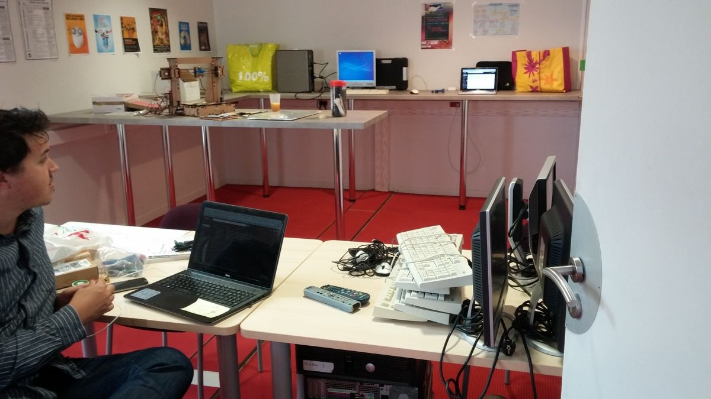

---
# You don't need to edit this file, it's empty on purpose.
# Edit theme's home layout instead if you wanna make some changes
layout: default
---

## Qui sommes nous ?

L'Association des Bidouilleurs Libristes (ABL) est une association loi 1901 qui a pour objet l'hébergement de projets libres, la promotion des communs et la promotion du libre (au sens licence libre).

Nous hébergeons des projets de tous types comme la création de jeux vidéos tels que [Spaceship](https://github.com/yoann-dufresne/Spaceship_node) ou [Artefact](https://bidouilleurslibristes.github.io/Artefact/).

L'association se veut porteuse de valeurs de partage et d'égalité et ce peu importe les origines ou les positions socioculturelles de ses membres. C'est pourquoi l'adhésion à l'association se fait à prix libre par simple déclaration au CA (la gratuité est courante), que chaque membre a exactement le même droit de décision que les autres membres et qu'aucune personne de l'association n'a de rôle particulier (pas de président, trésorier ou secrétaire). Le CA est constitué de toute personne souhaitant l'intégrer, et n'a qu'un pouvoir applicatif donné par l'AG. Toute décision prise par le CA peut être révoquée à tout moment par l'AG. Les statuts de l'association sont librement consultables [en ligne](/statuts_ABL.pdf).

## L'Espace Bidouille

Sous l'impulsion de notre association, le projet "Espace Bidouille" s'est concrétisé sur le campus Cité Scientifique de l'Université Lille au sein de la Maison Des Etudiants. Il s'agit d'un espace partagé entre toutes les associations signataires de la charte des lieux. Le lieu incorpore un espace de travail avec des plans de travail hauts et bas ainsi que quelques outils. Pour le moment le lieu est équipé en petit matériel de bricolage, possède une imprimante 3D et du matériel d'électronique basique (arduinos, raspberry pi et capteurs).

Notre association y tient plusieurs permanences par semaine : une permanence fixe tous les samedis entre 11h00 et 18h00 ainsi que des permanences variables durant la semaine selon la disponibilité et l'envie des membres. Vous pouvez être tenus informés des permanences via la [mailling list](https://listes.univ-lille1.fr/wws/subscribe/espacebidouille) de l'Espace Bidouille ou sa page [facebook](https://www.facebook.com/EspaceBidouille).

## Nous contacter / Nous rencontrer

Si vous souhaitez nous contacter ou nous rencontrer, que vous ayez des idées de projet ou que vous souhaitiez simplement discuter, vous pouvez venir lors d'une de nos permanences ou nous contacter à l'adresse suivante abl-ca[at]univ-lille1.fr pour se rencontrer à un autre moment.

